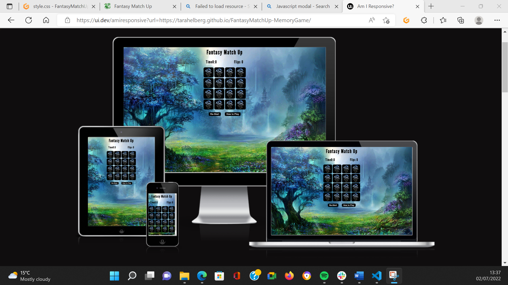
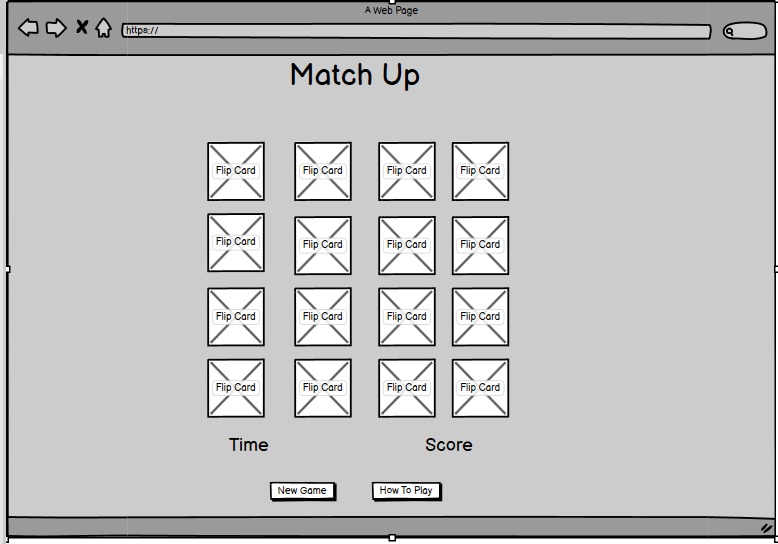
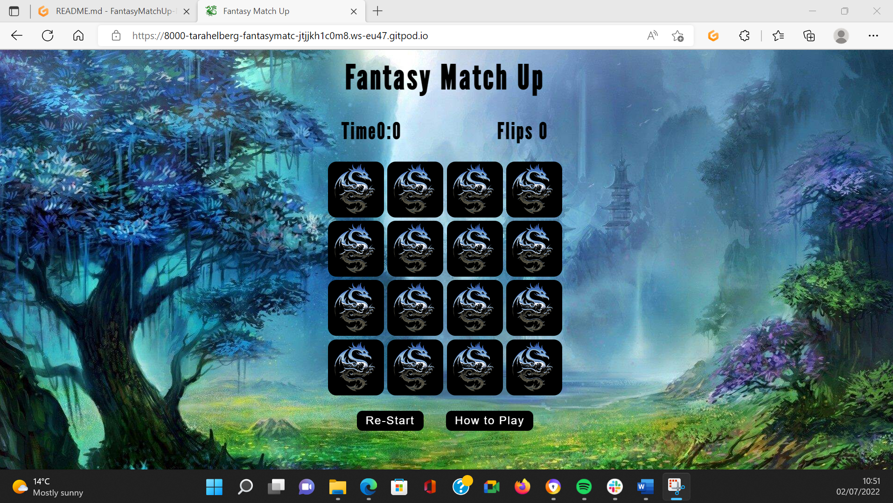
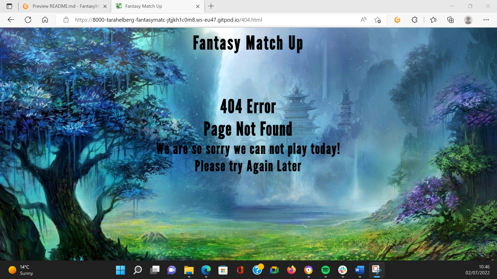
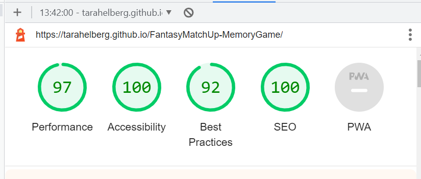

#   Fantasy Match Up

Fantasy Match Up is a basic memory card game based on a fantasy theme .Flip the cards to reveal the image if two match the cards stay up if not, they flip back over , remember where they are and try to find the matching images. A timer and flip count are included the aim is to try to beat your personal time and number of flips "turns of the cards" two cards flipped will be counted as only one move as it takes two moves to get a match. 

The user should be able to enjoy the game and feel calmed by the background and entertained by the chosen images. As well as Congratulated on winning the game.

# UX 

I aimed for a visually appealing website that has a fantasy theme , the background image sets the tone for the colours of the game with the foreground been in black , white and the silver of the dragons with a hint of blue in them.
The hovers on buttons and background of the flip cards are in blues that complement the background image and do not detract from the images. The flip cards are made in square blocks so as to fit into the background image with the tree and waterfalls to the sides of the cards visible to make the page visually appealing with a calming feel from the background image.
Images on the cards of Dragons and once the cards are flipped all images are of fantasy creatures to follow the theme. 
The layout is simple and consists of a Game Page Title in black to be easily visible against the background , under this is the game area that has a timer and flip count at the top and the sixteen game cards under them , followed by the Restart button and how to play button all navigation is simple and easy to see and follow.
The timer and flip card count originally at the bottom in the wireframes was moved to the top of the cards as I felt that this was a better place for them to be positioned for the user.
On clicking the how to a Modal pop up will display the game rules.
At the end of the game another Modal pup up will display the users winning scores amount of time and flips taken.
The page has a Favicon that is a dragon going with the theme of fantasy and the dragons on the front of the flip cards.

## Balsamiq Wireframes

 

# Features
 * Game Page

    + A Restart Button is clear and easy to find, this will by clicking on restarts the game flip count and timer as well as reshuffles the cards.
    + The How to Play Button is clear and easy to find , this will on clicking pop up the Game Rules on how to play and has an easy to leave and see Play Button to click on to leave and go back to the Game area
    + Flip counter is displayed and counts the number of flips a user takes in a game two cards flipped will only amount to one flip as two cards are required for a match
    + Timer is display and visible the timer starts not he first card flipped and continues until either the game is won or the restart button is clicked
    + On completing of the Game, a Game Won Modal pop up is display showing the number of flips taken to win the game and the time taken with a Congratulations message and an easily visible button to Play again to exit the Modal pop up . 
     

# Game Page   

* Page Tile 
    + The Page Title is displayed in Black to be easily Visible against the background image

* Body
    + The body has the main game area and displays the Timer and Flip counter both in black to be visible against the background image
    + The 16 Cards have a black background to show the beautiful silver dragons at their best and for great visibility against the background image, when flipped the background is a dark blue to complement the background image and them of the page and show the flipped side images well.
    + the Re-Start game button and How to play Button re below the game cards and are in Black with white text sticking with the theme and for visibility on hover the background changes to the same blue and the background of the flipped cards , carrying through the colour theme.
    + The Modal pop ups both the How to play and Game Won message are the same in style and colour following through with the them and keeping a consistent visual image for the user.     
     
 
# 404 Error Page Not found

* 404.html Section
    + Background Image the same as index.html Game page
    + 404 Error message visible with an apology and request to try again later.

# Technologies / Support Used

* Below is a list of Technologies / Support I have used to build my site.
 
    + HTML is used to provide the structure and content of the website.
    + CSS is used via link to the HTML to provided style the pages.
    + Code Institute lessons and the Love Maths assisting with my project in how to use JavaScript.
    + Jshint to run my JavaScript code though
    + Git used to code within and provided backups of all my code.
    + GitHub for my repository and external project deployment.
    + Google Fonts for my font choose for the project.
    + Favicon.ico for adding a nice little personal touch to my page
    + W3S Schools for code assistance and information

# Testing

 * Testing During development of the pages was done through the project to see how the project looked and felt

  * Manual Testing

| Feature           |  Expect              |  Action |  Result                 |
|-------------------|----------------------|---------|-------------------------|
| Flip Cards x 16   |  Click on flips      |Click On | Flips to reveal back    |
| Flip Cards x 16   |  When Flips no Match |JS Flips | Flips back over No Match|
| Flip Cards x 16   |  When Flips Matched  |JS Stays | Flips stay up on Match  |
| Re-tart Button    |  Re-Starts game      |Click On | 0 Time ,Flip count ,Game|
| How To Play Button|  Game Rules Pop Up   |Click On | Game Rules Pop Up       |
| Play Button(Rules)|  Close Rules Pop Up  |Click On | Close Rules Pop Up      |
| Game Won Message  |  Pops up at Game Won |Game Won | Pops Up Won Message     |
| Play Again"Button"|  Closes Won Message  |Click On | Closes Won Message      |
 
* User Testing

        + Expectations
      As a user I wanted the site to 
      1. Be Visually appealing, 
      2. Easy to navigate and understand,
      3. I wanted the game to supply function and the timer , flip count and cards to be responsive and work as they should,
      4. I wanted to be told when I had won and how long I had taken and how many flips it had taken me to win so I could try and beat my score.
    + Result
      As a user I was able to  
      1. I found it to be Visually appealing,
      2. I found it to be easy to navigate and understand,
      3. I found that the timer, flip count and cards responded as they should,
      4. I found that I was congratulated and shown my time and flips . 

     
   + Testing done via git preview.
   + Testing of the media queries was carried out via dev tools on Microsoft Edge.
   + HTML was tested through W3C Html validator
   + CSS was tested through W3C CSS Validator 
   + JavaScript testing done via dev tools in Microsoft Edge via console.log
   + JavaScript also run through Jshint
   + HTML was run through an online formatter, FreeFormatter.com
   + Responsive design media queries tested through Am I Responsive
   + Lighthouse used to test webpage for Performance, Accessibility , Best Practice and SEO
   + Deployed project was tested in my default browser Microsoft Edge as wells as Google Chrome and Firefox.

# Bugs

* Testing During development of the pages was done through the project to see how the project looked and felt
* Testing and debugging of JavaScript was done constantly via dev tools console.log as this was my first-time using JavaScript many where found a lot to do with using capital or forgetting to use ids or classes to connect the function to the html using the assistance of dev tools and google, I was able to find the bugs and correct the errors in the code

# Validator Testing

* Test Validators
    + HTML - W3C Html Validator - No errors returned when passed through .
    + CSS - W3C CSS Validator - No errors returned when passed through .
    + Jshint - Jshint.com - No errors returned when passed through .
    + JavaScript - Dev tools console.log in Microsoft Edge - No errors showing in Console.log .
    + RESPONSIVENESS - Am I Responsive for different devices media queries .
    + LIGHTHOUSE - Website tested for Performance, Accessibility, Best Practice and SEO as seen below .

# Deployment of Project

* Deployment was made possible by GitHub
    + Initiated a repository in git : https://github.com/TaraHelberg/FantasyMatchUp-MemoryGame
    + Created all folders and files and code project
    + Go to GitHub website
    + Go to my repository in the GitHub
    + Go to Settings tab click on
    + Go to GitHub Page and linking the main root to Master Branch 
    + Once this is done the page will automatically create the ribbon with the http host page name that is been hosted by GitHub.
    The live link can be found here : https://tarahelberg.github.io/FantasyMatchUp-MemoryGame/
    + Project was cloned via GitHub :

# Credits

   * Code Institute without who I would have had no base to begin a project & Readme.md Template .https://codeinstitute.net/ie/
   * GitHub for my workspace and saving all my work as well as my deployed project . https://github.com/
   * Reuben Ferrante my mentor without all his great guidance I would be lost. A Huge Thanks. https://github.com/arex18
   * The Slack community - for someone always been there no matter the time and with advice or direction. https://slack.com
   * Balsamiq used to build the wireframes for my project. https://balsamiq.com
   * Google Fonts for my font choose for the project. https://fonts.google.com      
   * Free Convert - for compressing my images for better upload time . https://www.freeconvert.com/image-compressor
   * Stack Overflow for all the information to assist with my project .https://stackoverflow.com
   * W3C Validators both HTML and CSS to keep a check on my code. The W3C Markup Validation Service
https://validator.w3.org
   * I am Responsive for a fantastic spot to see a visual of responsiveness. https://ui.dev/amiresponsive?msclkid=400b1adabe5b11ecbc48938198bb87b4
   * Lighthouse testing system whom I can't find a webpage link for but am grateful for been able to use.

# Copied Code / Code assistance 
* W3S School for code assistance and information. //https://www.w3schools.com/howto/howto_css_modals.asp
  Particularly the Modal Pop Ups  
* https://marina-ferreira.github.io/tutorials/js/memory-game/ This is the base from my Game I have used the ideas and some of the code from here I have tried to adapt it as much as possible 

# Imagery for Project

 * Images obtained 
 + Background Image : https://getwallpapers.com/wallpaper/full/a/a/6/373672.jpg
 + Front Card Image : https://freepngimg.com/png/35735-fantasy-dragon/download
 + Back Card Images : https://www.freepngs.com/fantasy-png-images - dark fey,dark griffon, green fey and pink wingcat .
 + Back Card Images : https://pngimg.com/images/fantasy/ - dark pegasus , green dragon ,green fairy and tree groot .

 
 +  ### Note 
 * All information within this game is for education and training purposes only .
 * All code has been as much as possible credited to the source that the code came from 
 * Please note that I did use google a lot which gave me access to many , many tutorials in making this game and it is possible that I have not referred to something I might have seen that inspired me or gave me direction in this I am apologetic if I should have forgotten to refer to code that inspired me during my project.
 * I would like to thank everyone for all and any assistance given during the development of my game . 

